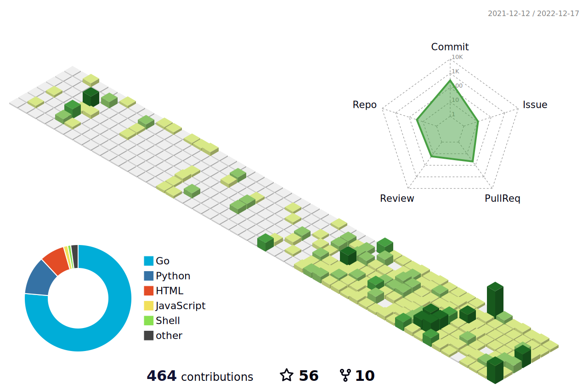
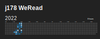
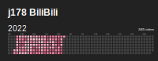

# Daily track

## [GitHub contribution calendar](https://github.com/j178) (Updated at 2022-09-15)

## [Leetcode summary](https://leetcode-cn.com/u/j178) (Updated at 2022-09-15)

## [WeRead history](https://weread.qq.com) (Updated at 2022-04-11)

## [BiliBili watch history](https://bilibili.com) (Updated at 2022-09-15)

## Credits
Thanks to [@yihong0618](https://github.com/yihong0618) for the original inspiration and the wonderful [github-poster](https://github.com/yihong0618/GitHubPoster) project.

## TODO
- [x] 生成 github 提交记录图
- [x] add cache for pip and playwright
- [x] 增加极客时间学习记录
- [x] 用 cookie，避免每次重新登陆，增加登录失败重试
- [x] 增加 Bilibili 每日看视频数量，生成 svg
- [x] 增加读书记录
- [ ] 增加 keep 跑步记录
- [ ] 增加背单词记录
- [ ] 增加 YouTube 记录
- [ ] 增加早起记录
- [ ] 增加每日任务
